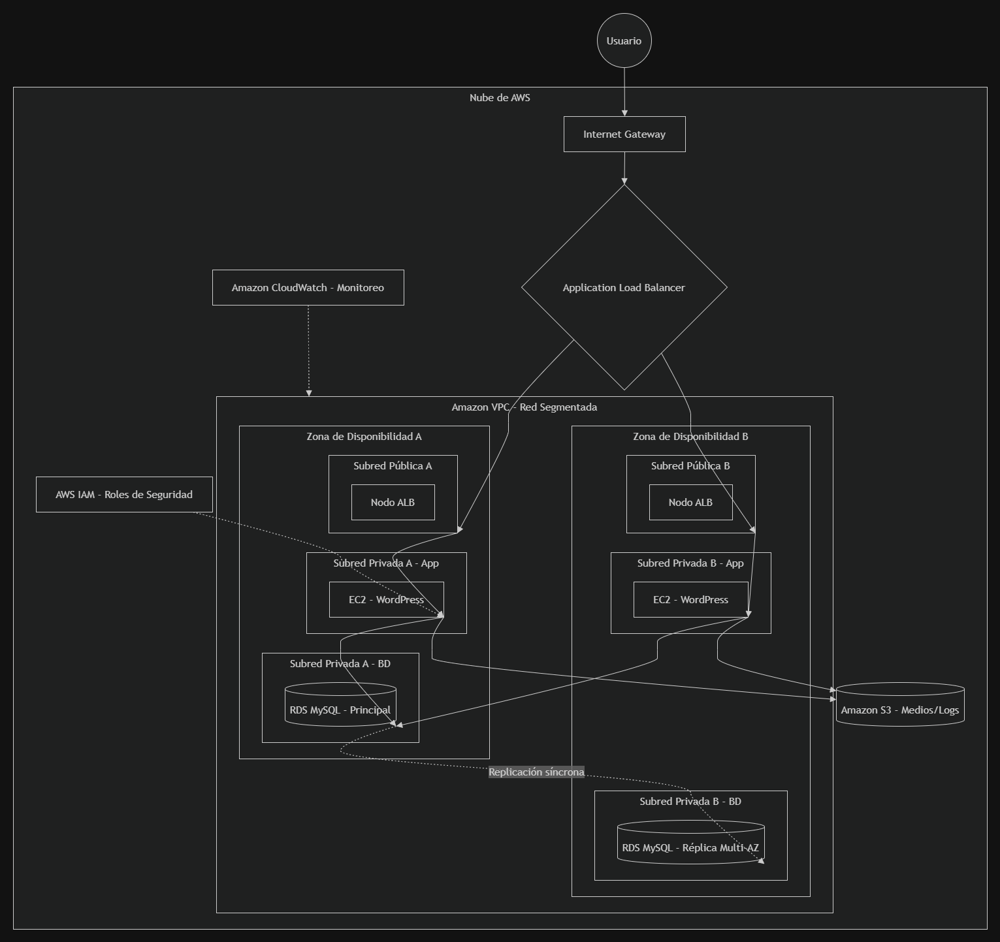

 # Justificación de la Arquitectura Cloud para Comercial Nova

El presente diseño arquitectónico ha sido elaborado para satisfacer los requerimientos de Comercial Nova, priorizando la alta disponibilidad, seguridad, escalabilidad y eficiencia operativa en AWS. A continuación, se justifican las decisiones técnicas por cada capa de servicio:

## 1. Arquitectura de Red Segmentada (Amazon VPC)
La red se ha segmentado en dos Zonas de Disponibilidad (Multi-AZ) para garantizar tolerancia a fallos. Se implementó un esquema de separación de tráfico muy estricto:
*   **Subredes Públicas (La DMZ):** Actúan como la zona desmilitarizada donde únicamente reside el Application Load Balancer (ALB). Solo este componente tiene visibilidad directa hacia Internet a través del Internet Gateway.
*   **Subredes Privadas (La LAN Interna):** Operan como un entorno local altamente aislado donde residen las instancias EC2 (aplicación) y RDS (datos). Al no tener IPs públicas, la superficie de ataque se reduce drásticamente.

## 2. Capa de Cómputo y Escalabilidad (Amazon EC2 y ALB)
*   **Application Load Balancer:** Se encarga de distribuir el tráfico web entrante de manera equitativa entre los nodos de WordPress, evitando la saturación de un solo servidor y sirviendo como única puerta de entrada HTTP/HTTPS.
*   **Auto Scaling Group (EC2):** Se han aprovisionado al menos 2 instancias EC2 con Linux, Apache/Nginx y PHP. El uso de Auto Scaling permite que la infraestructura escale dinámicamente frente a picos de tráfico y realice un *autohealing* (reemplazo automático) si alguna instancia reporta un estado no saludable.

## 3. Capa de Base de Datos (Amazon RDS)
Se optó por una base de datos relacional administrada (MySQL/MariaDB) a través de Amazon RDS.
*   **Alta Disponibilidad:** Configurada en modo Multi-AZ con replicación síncrona hacia un nodo Standby en la segunda zona de disponibilidad. Si la base de datos principal falla, se realiza un *failover* automático sin intervención manual.
*   **Seguridad:** Su Security Group restringe el ingreso por el puerto 3306 permitiendo tráfico *exclusivamente* proveniente del Security Group de las instancias EC2.

## 4. Almacenamiento y Gestión de Medios (Amazon S3)
El almacenamiento local de las EC2 es efímero en un entorno de Auto Scaling. Por ello, todos los archivos multimedia, imágenes subidas a WordPress, y posibles logs/backups, se centralizan en un bucket de **Amazon S3**. 
*   **Desacoplamiento:** Esto aligera la carga en los servidores web y hace que el contenido multimedia sea inmutable independientemente de las instancias que se creen o destruyan. 
*   **Seguridad:** El bucket se mantiene privado, y el acceso a los objetos se gestiona mediante roles de IAM y políticas de bucket.

## 5. Seguridad de Acceso (AWS IAM y Security Groups)
*   **Principio de Mínimo Privilegio:** Las instancias EC2 se comunican con S3 y RDS utilizando Roles de IAM predefinidos, eliminando por completo la necesidad de almacenar credenciales estáticas (Access Keys) o contraseñas en código plano dentro del servidor.
*   **Reglas de Firewall:** Todo el acceso por SSH está estrictamente limitado a la IP del administrador u operado mediante AWS Systems Manager (Session Manager) para no exponer el puerto 22 a internet.

## 6. Monitoreo y Observabilidad (Amazon CloudWatch)
Para el control operativo, se implementan Dashboards en CloudWatch que unifican las métricas críticas de uso de CPU y lecturas/escrituras en RDS y EC2, junto con alarmas que permiten al equipo tomar decisiones de *rightsizing* e identificar cuellos de botella antes de que afecten la disponibilidad del portal.